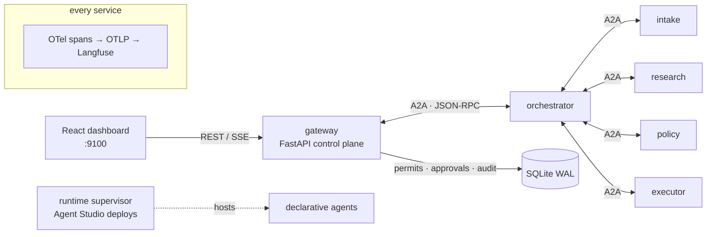

# tinyclaw — Architecture

## The one-picture version

## Layers

| Layer | What it is | Where |
|---|---|---|
| **Protocol** | Official `a2a-sdk` (spec 0.3): JSON-RPC over HTTP, Agent Cards at `/.well-known/agent-card.json`, task lifecycle incl. `input-required` | `core/agent.py`, `core/a2a_client.py` |
| **Observability** | OpenTelemetry with W3C tracecontext propagated **inside A2A message metadata** — one distributed trace spans every agent hop; GenAI-convention spans for LLM calls; OTLP export to self-hosted Langfuse | `core/observability/tracing.py` |
| **Governance** | Policy-as-code engine (YAML rules, most-restrictive-wins, all hits audited), risk registry (`auto`/`threshold`/`always_human`/`blocked`), PII + injection guardrails pre-LLM, hash-chained tamper-evident audit log, agent identities & scopes | `core/governance/` |
| **Human oversight** | Approval queue backed by the A2A `input-required` state; decisions signed (who/when/comment) and hash-chained | `gateway/app.py`, scenario orchestrators |
| **Execution authorization** | HMAC-signed permits bound to task + action + TTL. AUTO route: gateway signs after policy pass. HUMAN route: signs only after a recorded human decision. The executor refuses everything else | `core/hitl/tokens.py`, executor agents |
| **Control plane** | Gateway: single writer of the audit chain, event fan-out (SSE), KPIs, scenario registry, playground, Agent Studio API | `gateway/` |
| **Agent Studio** | Declarative agents (definition = data), versioned registry, test console, policy dry-run, governed deploy (high-risk definitions route through the same human queue) | `runtime/`, `gateway/app.py` |
| **Scenario packs** | Pluggable demo scenarios; procurement ships first | `scenarios/procurement/` |

## The governed flow (procurement)

1. Request → orchestrator (`message/send`). Orchestrator publishes a **plan artifact** *before* acting.
2. A2A delegation: intake (LLM extraction behind guardrails) → research (vendor/sanctions/budget tools) → policy (YAML evaluation + risk routing).
3. Orchestrator asks the gateway for an **execution permit**:
   - **deny** → task rejected, audited;
   - **auto** (tier 1) → gateway audits + signs, executor runs;
   - **human** (tier 2+) → approval created; A2A task parks in `input-required`.
4. Human decides in the dashboard. Approve → gateway signs a permit carrying the approver's identity, sends a resume message on the parked task → executor verifies the signature → PO issued → task completes. Reject → task rejected.
5. Every step: span in the distributed trace, event on the SSE feed, entry in the hash-chained audit log.

## Patterns borrowed from production coding-agent harnesses

tinyclaw deliberately reuses governance patterns proven in production coding agents (Claude Code / ZCode-class harnesses):

| Harness pattern | tinyclaw equivalent |
|---|---|
| Plan mode: research → plan → human approval → execute | Orchestrator publishes a `task.plan` artifact before acting; plan-approval gating for tier-3 is the roadmap extension |
| Live todo list the observer can audit any moment | Plan checklist in the task detail view, stage-mirrored tasks table |
| Permission denials are final; no verbatim retries | Policy `deny` ends the task; executor permanently refuses unpermitted actions |
| Hooks intercept tool calls mid-flight | Gateway observes every hop today; acting as a blocking middleware (policy enforcement point) is the documented evolution |
| Approvals never carry across contexts | Permits bound to task + action + TTL — no ambient authority |
| Skills loaded on demand, not stuffed into context | Scenario packs as lazily-bound capability bundles |
| Mandatory faithful outcome reporting | Every agent claim must be traceable to a signed audit entry / artifact |

## Design decisions (ADR summary)

- **Deterministic control plane, LLM-powered workers.** The orchestrator is code, not a model — predictable supervision around generative parts. LLM usage lives in intake (extraction) and Studio agents.
- **Gateway as single audit writer.** One writer keeps the hash chain linear and tamper-evident; agents submit audit records over an authenticated internal API.
- **Trace context in message metadata.** W3C tracecontext rides the protocol itself (visible in any protocol log), surviving hops where transport headers wouldn't.
- **Mock-first LLM layer.** The entire platform runs (and CI tests it) with a deterministic mock — zero keys, reproducible demos; providers switch by env.
- **SQLite over Postgres.** Zero-config demo with WAL; the data model is deliberately thin so swapping the engine is a `db.py` change.

## Production path (documented, not built)

- Inter-agent auth: static bearer tokens today → Agent Card `security_schemes` + OAuth2 client-credentials or mTLS.
- Agent-to-agent transport: HTTP today; A2A gRPC transport available in the SDK.
- Studio tool execution: tools are declared for governance; wiring real tool runners (containers, sandboxed) is the roadmap.
- Scale: replace SQLite with Postgres, in-memory task stores with the SDK's SQL task store, static seed with real intake channels.
